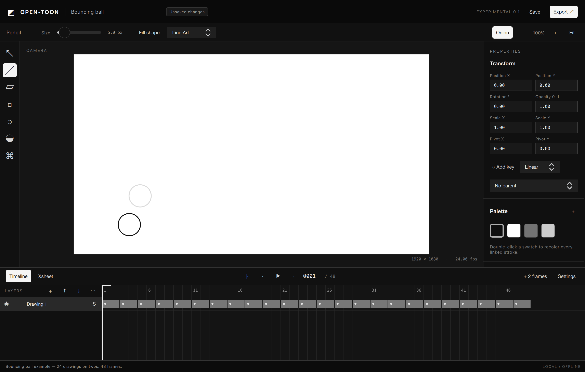

# OPEN-TOON

An independent open-source desktop animation project combining vector and bitmap drawing, frame-by-frame and cut-out animation, rigging, compositing and production tools.

**Current stage: experimental native editor. P11 is not complete.** A C++20/Qt Quick application now supports mouse drawing, vector editing, MyPaint raster brushes, layer and range editing, transform keys, compressed SQLite project revisions and PNG export. The roadmap still covers 282 capabilities in 26 domains; working subsets are marked partial, with no phase claimed complete.

Start with the [build instructions](docs/implementation/BUILD.md), [user guide](docs/implementation/USER-GUIDE.md) and [implementation status](docs/implementation/STATUS.md).

The product will use a clean black, white and gray interface. **The entire first-party product is in English by requirement:** UI, messages, built-in assets, help, code and public documentation. The previous research, Markdown documents and canonical catalogs have also been translated into English. User-created content remains multilingual.



## Start here

1. [Documentation map](docs/INDEX.md).
2. [Long-term development roadmap](docs/planning/README.md).
3. [23 phases with dependencies and acceptance criteria](docs/planning/PHASES.md).
4. [Open-source libraries and adoption decisions](docs/planning/LIBRARIES.md).
5. [Effort and staffing assumptions](docs/planning/ESTIMATES.md).
6. [First implementation backlog](docs/planning/FIRST-STEPS.md).
7. [Functional catalog](docs/catalog/README.md).
8. [Architecture](docs/architecture/02-system-design.md) and [document format](docs/architecture/03-document-model.md).
9. [Visual design](docs/design/01-design-system.md) and [English language policy](docs/design/02-language-policy.md).

## Technical direction

**C++20 + Qt 6 / Qt Quick (QML)** for Windows, macOS and Linux, with a UI-independent domain, local storage, a shared headless evaluator and explicit integration adapters. Mature open-source components will provide infrastructure such as storage, brushes, image/media IO, color management and numerical routines. Graphics and other high-risk candidates must pass measured spikes before adoption.

The experimental first-film workflow can draw, expose, play, save, reopen and export a two-second sequence of 48 PNG frames. Production acceptance and platform qualification remain open. Reliable 2D workflows precede advanced controllers, morphing, 3D, game exports and optional studio/AI extensions. The roadmap provides effort ranges and assumptions, not promised release dates.

## For contributors and AI agents

Read [AGENTS.md](AGENTS.md) and the relevant phase before making changes. Canonical JSON records have stable IDs; generated views must not be edited manually. Planning completion is separate from implementation status.

```sh
python3 scripts/catalog.py stats
python3 scripts/catalog.py show DEF-005
python3 scripts/roadmap.py phase P09
python3 scripts/roadmap.py feature DEF-005
python3 scripts/roadmap.py library LIB-MYPAINT
python3 scripts/catalog.py render
python3 scripts/roadmap.py render
python3 scripts/validate_docs.py
```

Documentation tools require only Python 3.11+ and its standard library. No application dependencies need to be installed to inspect the plan.

## License

Original contributions are licensed under **GPL-3.0-or-later**; see [LICENSE](LICENSE). Third-party libraries and assets retain their respective licenses, which must be checked for the exact distributed build. Artwork created by users does not acquire the application's license merely through using it.

OPEN-TOON is the working project name. Distribution, support and compatibility claims will reflect demonstrated implementation evidence.
