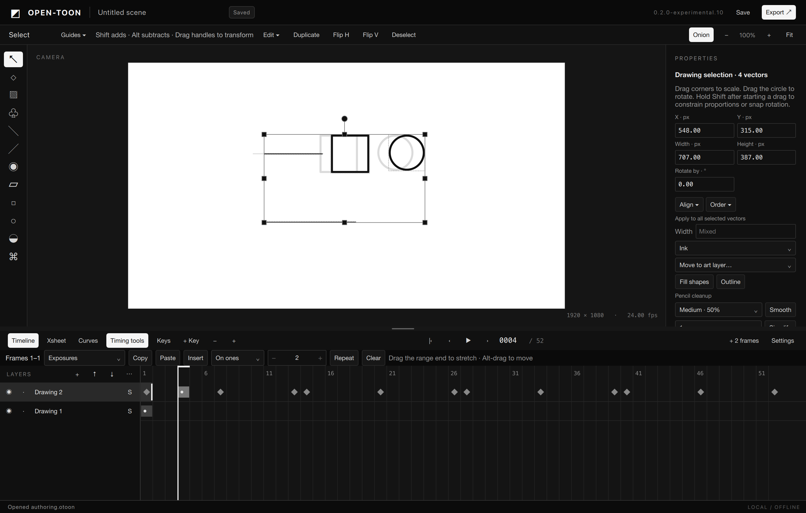

# OPEN-TOON

An open-source desktop application for 2D drawing and animation, built around direct
canvas editing, an integrated timeline and visual motion curves.

## Get started

Follow the [build instructions](docs/implementation/BUILD.md) to run the application
from source. Public prebuilt downloads are not available yet. macOS is the primary
development platform; Windows and Linux qualification remains in progress.

The [user guide](docs/implementation/USER-GUIDE.md) covers drawing, animation and
project workflows. Developers preparing a macOS package can use the
[packaging notes](docs/implementation/MACOS-PREVIEW.md).

## Features

- Vector drawing and MyPaint raster brushes with mouse and pressure input.
- Direct selection, transforms, vector lasso, clipboard, alignment and cleanup.
- Layers, exposures, onion skin, playback and integrated Timeline/Xsheet editing.
- Visual pose animation, editable motion curves and grouped keyframe operations.
- Local project revisions, recovery snapshots and PNG sequence export.

OPEN-TOON is under active development. The [implementation status](docs/implementation/STATUS.md)
describes supported workflows and current limitations; the [roadmap](docs/planning/PHASES.md)
covers planned cameras, audio, rigging, deformation and compositing.

## Documentation

| Resource | Purpose |
|---|---|
| [User guide](docs/implementation/USER-GUIDE.md) | Drawing, animation and editing workflows |
| [Release notes](docs/implementation/RELEASES.md) | Changes and verification by version |
| [Documentation index](docs/INDEX.md) | Research, design and engineering references |
| [Functional catalog](docs/catalog/README.md) | Requirements and acceptance criteria |
| [Development plan](docs/planning/README.md) | Phases, dependencies and implementation order |
| [Architecture](docs/architecture/02-system-design.md) | Module boundaries and design decisions |
| [Dependencies](docs/implementation/DEPENDENCIES.md) | Open-source components and redistribution records |

## Development

C++20 and Qt 6/Qt Quick provide the native application. The document and application
modules are independent of Qt; adapters integrate rendering, input, SQLite storage
and third-party libraries. Document edits are transactional and undoable.

Read [CONTRIBUTING.md](CONTRIBUTING.md) and [AGENTS.md](AGENTS.md) before contributing.
Canonical JSON catalogs provide stable feature IDs and machine-readable planning
context. Validate documentation with `python3 scripts/validate_docs.py`.

## License

Original contributions are licensed under [GPL-3.0-or-later](LICENSE).
Dependencies retain their respective licenses. Artwork created with the application
remains the creator's work.

OPEN-TOON is an independent project and is not affiliated with Toon Boom Animation.
