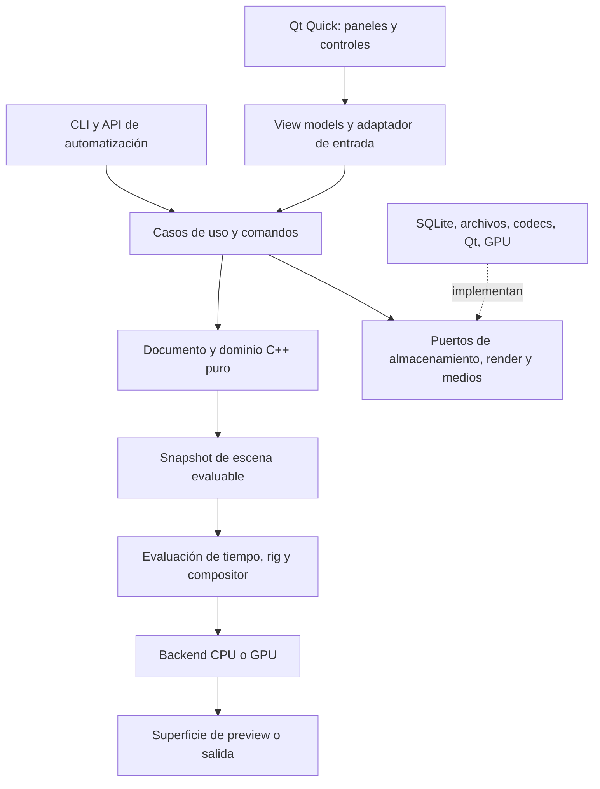

# Arquitectura de sistema y clean code

Estado: propuesta para el futuro plan, sin implementación. Una aplicación modular en un repositorio es suficiente. No se necesitan microservicios para dibujar, guardar y renderizar localmente.

## Límites y dependencias



Las flechas indican dependencias conceptuales; adapters se conectan en el punto de composición de la aplicación. El dominio no conoce vistas, rutas de instalación ni librerías de codecs. Los casos de uso coordinan transacciones y validan permisos del documento. Los adapters convierten tipos externos a contratos propios.

## Estructura prevista

```text
apps/
  desktop/                 # arranque Qt, composición y recursos
  render-cli/              # validación, render y conversión sin ventanas
modules/
  document/                # IDs, dibujos, capas, referencias y esquema
  timeline/                # intervalos, exposición, marcadores y tiempo
  geometry/                # curvas, perfiles, regiones y operaciones
  raster/                  # tiles, pinceles, selección y daños
  colour/                  # paletas y contratos de conversión
  animation/               # curvas y evaluación de propiedades
  rigging/                 # jerarquías, restricciones y poses
  deformation/             # bind, influencias y algoritmos
  compositor/              # grafo tipado, scheduling y operadores
  audio/                   # clips, mezcla y reloj
  assets/                  # biblioteca y dependencias
  application/             # comandos, consultas y sesiones
adapters/
  qt-ui/                   # view models y modelos de listas/tablas
  qt-input/                # tableta, gestos, captura y coordenadas
  render-rhi/              # frontera QRhi versionada
  render-cpu/              # referencia y diagnóstico
  storage/                 # SQLite, blobs y migraciones
  media/                   # codecs y procesos de render externos
  colour-ocio/             # configuración y transformación OCIO
  scripting/               # API externa y host aislado futuro
ui/
  tokens/                  # diseño visual portable
  components/              # botones, campos, paneles y menús
  workspaces/              # layouts de dibujo, animación y composición
tests/
  domain/ integration/ visual/ fixtures/ performance/
docs/
  research/ catalog/ architecture/ design/ planning/
```

No crear todos los directorios vacíos ahora. Se introducen cuando tengan una responsabilidad real. Cada módulo tendrá API pública pequeña, implementación privada y pruebas propias; CMake impedirá dependencias inversas. Las interfaces se justifican por un límite tecnológico o por más de una implementación real, no por convertir cada clase en una jerarquía.

## Tres tipos de estado

| Estado | Ejemplos | Dueño y persistencia |
|---|---|---|
| Documento | Dibujos, exposiciones, paletas, claves, conexiones | Núcleo, versionado y guardado |
| Sesión | Selección, frame actual, herramienta, operaciones provisionales | Sesión de edición, normalmente separado |
| Preferencias/layout | Atajos, densidad, tema, paneles | Perfil del usuario, fuera de la escena compartida |

Las cachés son datos derivados y descartables. Una caché jamás es la única copia de un dibujo. El renderer consume snapshots inmutables y no altera el documento al calcular una imagen.

## Comandos y transacciones

Ejemplo: `PaintRegion(drawingId, artLayerId, regionId, swatchId, expectedRevision)` valida referencias, calcula el cambio, confirma una transacción, publica un `DocumentDelta` y permite deshacer. Un comando no guarda punteros crudos a objetos de UI. Su entrada es serializable para scripting futuro, pero no hace falta implementar event sourcing completo.

El trazo tiene `begin/update/end/cancel`. Las muestras provisionales alimentan el feedback inmediato; al terminar se confirma un único gesto. Deshacer un trazo restaura su geometría o tiles y no añade miles de pasos. En operaciones largas, el cálculo trabaja sobre una revisión; antes de aplicar se comprueba que siga siendo válida. Cancelar descarta el resultado provisional.

Undo puede usar deltas inversos y recursos inmutables por hash. Una operación destructiva de raster conserva solo tiles modificados, no una copia completa de todo el proyecto. Las revisiones persistentes y la pila de undo son mecanismos distintos; su retención se especifica por separado.

## Pipeline de entrada y dibujo

1. Recibir eventos con posición, presión, inclinación, tipo de puntero y timestamp disponibles.
2. Convertir coordenadas de pantalla/HiDPI/vista a espacio de dibujo mediante una transformación explícita.
3. Resamplear y estabilizar en un pipeline medible, respetando el final del gesto y la cancelación.
4. Actualizar un overlay de baja latencia sin reconstruir todos los paneles ni persistir cada muestra.
5. Ajustar geometría o rasterizar tiles, confirmar el comando e invalidar regiones afectadas.

La presión constante del ratón se trata como un perfil definido. No asumir que todos los dispositivos aportan inclinación o goma. Evitar procesar dos veces un evento de tableta y su evento sintético de ratón. La vista rotada o reflejada afecta a la conversión de coordenadas, no al significado del documento.

## Evaluación y render

`Scene + revision + rationalTime + renderProfile → evaluated scene → graph → frame`. Primero se resuelven exposiciones y curvas, después transformaciones/rig/deformación, finalmente composición y salida. Esta es una separación lógica: se puede fusionar trabajo por rendimiento sin cambiar el contrato.

El grafo tiene puertos tipados y validación de ciclos. Las dependencias de transformación y las de imagen no se confunden. Un operador declara entradas, parámetros, región necesaria, extensión del resultado, política de color/alfa, caché y comportamiento cuando falta un recurso. Un blur solicita halos de tiles; una partícula con estado exige evaluación temporal o caché reproducible. No se presume que todos los nodos sean funciones puras de un único frame.

Clave de caché propuesta: versión del operador + hashes de entradas + parámetros evaluados + tiempo cuando aplique + perfil de render/color + semilla. Cambiar una paleta invalida consumidores de sus IDs; cambiar un dato de layout de UI no invalida nada gráfico. La caché tiene presupuesto y desalojo LRU o equivalente medido.

Preview y salida final comparten evaluación semántica. El preview puede reducir resolución, muestras o complejidad, pero debe mostrar cuándo está incompleto. Un nodo desconocido no se ignora silenciosamente en exportación final: se bloquea la salida o se exige una política de fallback explícita.

## Hilos y procesos

| Contexto | Trabajo | Restricción |
|---|---|---|
| UI | Entrada, selección, comandos cortos y accesibilidad | Sin decodificación ni render final bloqueante |
| Render | Evaluación visible y envío GPU | Sin mutaciones directas del documento |
| Workers | Importación, thumbnails, geometría y guardado de blobs | Cancelables, con revisión y presupuesto |
| Audio | Mezcla y reloj | Sin asignaciones no acotadas ni locks largos en callback |
| Procesos externos | Encoder, plugins no confiables o renderizadores | IPC versionado, límites y recuperación de fallos |

La distribución real se mide; no crear un hilo por nodo. Las reglas de sincronización de [QQuickRhiItem](https://doc.qt.io/qt-6/qquickrhiitem.html) exigen separar estado UI y renderer. Usar snapshots/deltas y colas, con puntos claros de publicación.

## Ampliar una capacidad

Una nueva herramienta declara metadatos, comandos, inspector y overlays; una nueva operación gráfica declara contrato de nodo y kernel; un formato nuevo implementa un adapter y un informe de conversión. Ninguno necesita editar un `AppManager` que controle todo. Los plugins externos y su ABI estable se posponen hasta que exista al menos un conjunto interno de operaciones que haya demostrado el diseño.

Al cargar un proyecto se preservan bloques desconocidos para evitar perder información. Plugins y scripts no se ejecutan automáticamente por abrir un archivo. La coedición futura debe respetar revisiones y conflictos de recursos; no añadir un CRDT genérico a geometría, píxeles y audio suponiendo que resolverá su semántica.

## Reglas de código

- Ownership explícito, RAII y contenedores con invariantes; minimizar `shared_ptr` y prohíbir ciclos de ownership.
- Tipos distintos para IDs, frames, segundos, píxeles y espacios de coordenadas. No intercambiar `int` o `double` sin unidad en APIs públicas.
- Errores de dominio como resultados tipados; excepciones y fallos externos se traducen en límites. No depender de `std::expected` si se mantiene C++20 sin biblioteca auxiliar.
- Sin singletons mutables de documento, registries globales de herramientas ni llamadas al disco desde entidades.
- QML muestra estado y dispara acciones; no implementa interpolación, serialización o algoritmos de pincel.
- Formato y lint automatizados; revisiones centradas en comportamiento, claridad y contratos.
- Registrar diagnósticos estructurados sin rutas personales ni contenido artístico por defecto. Métricas de rendimiento locales; cualquier telemetría futura será optativa.

La escalabilidad buscada es poder añadir herramientas y escenas grandes con límites claros; no multiplicar frameworks, capas de abstracción o servicios por anticipación.
