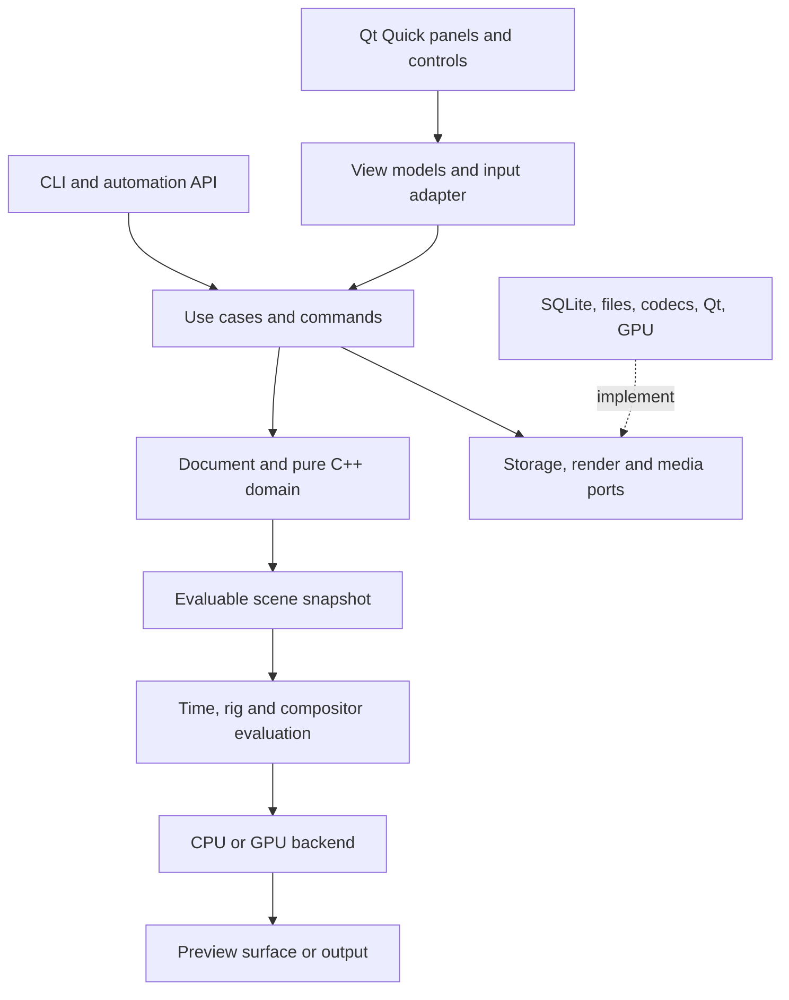

# System architecture and clean code

Status: planned architecture, not an implementation. A modular application in one repository is sufficient. Drawing, saving and local rendering do not require microservices.

## Boundaries and dependencies



Arrows represent conceptual dependencies; adapters are connected at the application's composition root. The domain knows nothing about views, installation paths or codec libraries. Use cases coordinate transactions and validate document permissions. Adapters convert external types into owned contracts.

## Planned structure

```text
apps/
  desktop/                 # Qt startup, composition and resources
  render-cli/              # headless validation, rendering and conversion
modules/
  document/                # IDs, drawings, layers, references and schema
  timeline/                # intervals, exposures, markers and time
  geometry/                # curves, profiles, regions and operations
  raster/                  # tiles, brushes, selection and dirty regions
  colour/                  # palettes and conversion contracts
  animation/               # curves and property evaluation
  rigging/                 # hierarchies, constraints and poses
  deformation/             # binding, influences and algorithms
  compositor/              # typed graph, scheduling and operators
  audio/                   # clips, mixing and clock
  assets/                  # library and dependencies
  application/             # commands, queries and sessions
adapters/
  qt-ui/                   # view models and list/table models
  qt-input/                # tablet, gestures, capture and coordinates
  render-rhi/              # versioned QRhi boundary
  render-cpu/              # reference and diagnostics
  storage/                 # SQLite, blobs and migrations
  media/                   # codecs and external render processes
  colour-ocio/             # OCIO configuration and transforms
  scripting/               # external API and future isolated host
ui/
  tokens/                  # portable visual design
  components/              # buttons, fields, panels and menus
  workspaces/              # drawing, animation and compositing layouts
tests/
  domain/ integration/ visual/ fixtures/ performance/
docs/
  research/ catalog/ architecture/ design/ planning/
```

Do not create every directory empty now. Introduce modules when they have a real responsibility. Each has a small public API, private implementation and appropriate tests; CMake prevents reverse dependencies. Interfaces are justified by a technology boundary or multiple real implementations, not by turning every class into an inheritance hierarchy. The layer families in the [execution rules](../planning/EXECUTION.md) describe these same boundaries, not a second competing directory tree.

## Three kinds of state

| State | Examples | Ownership and persistence |
|---|---|---|
| Document | Drawings, exposures, palettes, keys, connections | Core; versioned and saved |
| Session | Selection, current frame, tool, provisional operations | Editing session; normally separate |
| Preferences/layout | Shortcuts, density, theme, panels | User profile outside the shared scene |

Caches are derived, disposable data. A cache is never the only copy of a drawing. The renderer consumes immutable snapshots and does not mutate the document while evaluating an image.

## Commands and transactions

For example, `PaintRegion(drawingId, artLayerId, regionId, swatchId, expectedRevision)` validates references, computes a change, commits a transaction, publishes a `DocumentDelta` and supports undo. Commands do not retain raw pointers to UI objects. Inputs are serializable for future scripting, without requiring a complete event-sourcing system.

Strokes have `begin/update/end/cancel`. Provisional samples provide immediate feedback; completion commits one gesture. Undo restores its geometry or tiles rather than adding thousands of steps. Long operations compute against a revision and verify its validity before applying results. Cancellation discards provisional output.

Undo can use inverse deltas and immutable resources addressed by hash. Destructive raster operations retain changed tiles rather than copying the entire project. Persistent revisions and the undo stack are distinct mechanisms with separately specified retention.

## Input and drawing pipeline

1. Receive available position, pressure, tilt, pointer type and timestamp events.
2. Convert screen/HiDPI/view coordinates into drawing space with an explicit transform.
3. Resample and stabilize through a measurable pipeline, respecting gesture completion and cancellation.
4. Update a low-latency overlay without rebuilding every panel or persisting each sample.
5. Fit geometry or rasterize tiles, commit the command and invalidate affected regions.

Constant mouse pressure uses a defined profile. Do not assume every device supports tilt or an eraser. Avoid processing both a tablet event and its synthetic mouse event. Rotated or mirrored views affect coordinate conversion, not document semantics.

## Evaluation and rendering

`Scene + revision + rationalTime + renderProfile → evaluated scene → graph → frame`. Resolve exposures and curves, then transforms/rig/deformation, then compositing and output. This logical separation permits fused computation for performance without changing the contract.

The graph has typed ports and cycle validation. Transform dependencies are distinct from image dependencies. Operators declare inputs, parameters, required regions, output bounds, color/alpha policy, cache behavior and missing-resource handling. Blur requests tile halos; stateful particles require temporal evaluation or reproducible caches. Not every node is a pure function of one frame.

Proposed cache key: operator version + input hashes + evaluated parameters + time where relevant + render/color profile + seed. A palette change invalidates consumers of its IDs; UI layout changes invalidate no graphics. Caches have budgets and a measured LRU or equivalent eviction policy.

Preview and final output share semantic evaluation. Preview may reduce resolution, samples or complexity, but must indicate incomplete results. Final export cannot silently ignore an unknown node: block output or require an explicit fallback policy.

## Threads and processes

| Context | Work | Constraint |
|---|---|---|
| UI | Input, selection, short commands, accessibility | No blocking decoding or final rendering |
| Render | Visible evaluation and GPU submission | No direct document mutation |
| Workers | Import, thumbnails, geometry, blob saving | Cancellable, revision-aware and budgeted |
| Audio | Mixing and clock | No unbounded allocation or long callback locks |
| External processes | Encoder, untrusted plugins or renderers | Versioned IPC, limits and failure recovery |

Measure the actual allocation of work; do not create a thread per node. [QQuickRhiItem synchronization](https://doc.qt.io/qt-6/qquickrhiitem.html) requires separating UI and renderer state. Use snapshots/deltas and queues with explicit publication points.

## Extending capabilities

A new tool declares metadata, commands, inspector and overlays; a graphics operation declares a node contract and kernel; a format implements an adapter and conversion report. None requires editing an all-controlling `AppManager`. Defer external plugins and stable ABI until an internal operation set has demonstrated the design.

Preserve unknown blocks when loading projects to avoid losing information. Opening a file never automatically executes plugins or scripts. Future co-editing must respect revisions and resource conflicts; adding a generic CRDT to geometry, pixels and audio does not resolve their semantics.

## Code rules

- Explicit ownership, RAII and containers with invariants; minimize `shared_ptr` and prohibit ownership cycles.
- Distinct types for IDs, frames, seconds, pixels and coordinate spaces. Do not interchange unitless `int` or `double` values in public APIs.
- Typed domain error results; translate exceptions and external failures at boundaries. Do not rely on `std::expected` under C++20 without a supporting library.
- No mutable document singletons, global tool registries or entity-level disk access.
- QML displays state and dispatches actions; it does not implement interpolation, serialization or brush algorithms.
- Automated formatting/linting; reviews focus on behavior, clarity and contracts.
- Structured diagnostics exclude personal paths and artwork by default. Performance metrics stay local; any future telemetry is optional.

Scalability means adding tools and handling large scenes through clear boundaries, not preemptively multiplying frameworks, abstractions or services.
