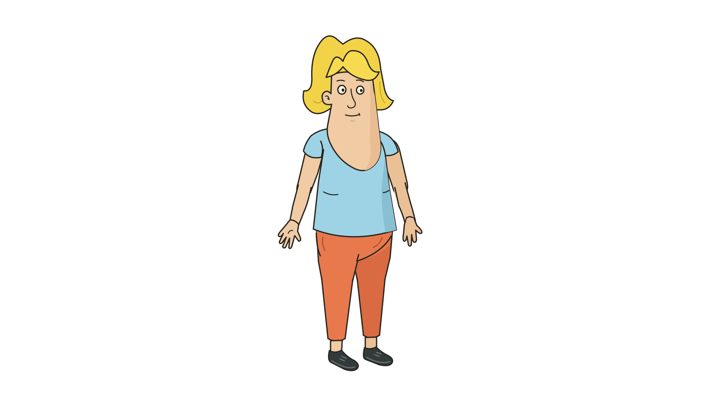
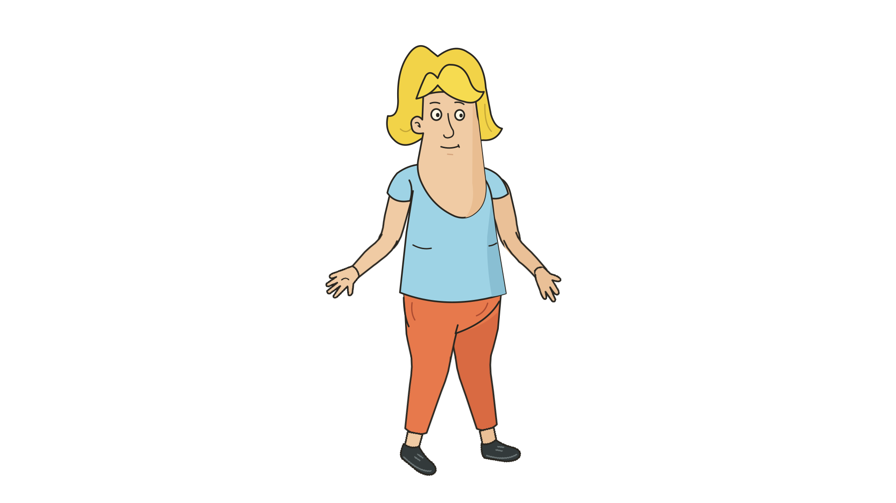

# Milo continuous rig study

Milo is the current character for new OPEN-TOON animation studies. The user
provided the source folder at `assets/characters/milo` in the project. Its
original SVG and 21 registered PNG pieces remain untouched. The derived
17-Part study combines each upper and lower arm or leg into one registered
image. A two-segment bone has its middle joint at the elbow or knee; the hand
or ankle follows the evaluated tip without separate motion keys. The shoes
remain children of their ankles.

The [saved project](../../examples/milo-continuous.otoon) is a 1920 × 1080,
48-frame editable study. Frame 0 matches the source's assembled rest drawing
within four 8-bit color levels over white. Frame 24 bends all four complete
limbs using contour meshes; frame 47 returns to the exact rest render. Every
480 × 270 preview frame remains one connected character silhouette. The
full-resolution bent frame also remains connected. The project reopens with
identical structure and frame-24 pixels. Retuning a middle-joint key changes
only the pose and one undo/redo restores the exact earlier/later pixels. The
native Qt Quick smoke opens this
project, switches to Rig at frame 24, presents the canvas, saves and reopens it.





The derived PNGs retain the original art's visible outlines and deliberately
preserve its 21-piece source master. They are one deformable image per limb
inside the rig, though the source paths were initially drawn as upper/lower
pieces. This is a tested continuity candidate, not accepted owner artistic
quality. Wider poses, replacement expressions/views, mouth shapes and the
complete 480-frame audiovisual Milo shot remain open.

Regenerate the derived images with optional asset-only Pillow, then run the
targeted renderer test. CairoSVG/Pillow are needed only if re-exporting the
SVG source with `export.py`; the app does not load them.

```sh
python3 assets/characters/milo/generate_continuous_parts.py
build/locked/opentoon_render_tests \
  'Milo uses four continuous limb images with joined bent and reopened output'
build/locked/open-toon.app/Contents/MacOS/open-toon \
  --open examples/milo-continuous.otoon --milo-smoke
```
