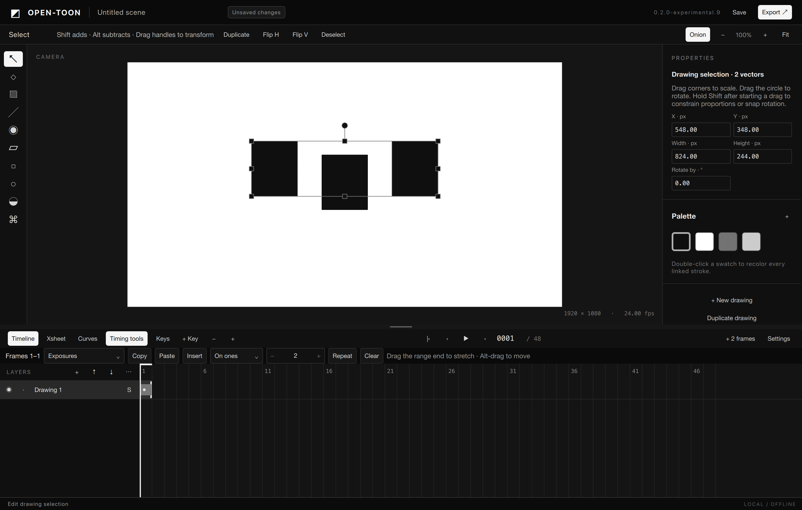

# Implementation status

**Experimental editor; P11 is not complete. No phase has passed all its exit criteria.** The full target remains P00–P11; the immediate planning priority is the bounded [Harmony Moment](../planning/HARMONY-MOMENT.md). Working subsets are marked `partial` in the feature catalog; the remaining scope has not been removed or silently deferred.

The editor runs locally on macOS and supports mouse drawing, sampled-pressure input, vector editing, layers, exposures, transform keys, project revisions and PNG export. See the [build instructions](BUILD.md) and [user guide](USER-GUIDE.md).

The [HM-04 composition kernel record](HM04-GRAPH-KERNEL.md) lists its three bounded
blocks of ten capabilities, tests and remaining acceptance work.

The current source milestone is `v0.2.0-experimental.14`. It is a source-only
milestone; the last locally qualified macOS preview and any earlier binaries
do not qualify this composition change.

## Phase coverage

| Phase | Status | Available subset | Remaining before completion |
|---|---|---|---|
| P00 | in_progress | Qt-free core, CPU reference renderer, locked infrastructure dependencies, bounded OpenToonz source audit and save failure tests. | Renderer comparison, successful reuse extraction/build audit, fill/deformation spikes, device matrix and production budgets. |
| P01 | in_progress | Native English QML shell, CMake modules, commands, immutable snapshots, undo/redo and validation. Typed character/peg/part property addresses separate rest, authored and evaluated values; format-5 migration preserves older scenes with source-version backups. Integrated resizable timing/curve workspace and selection-owned object/layer Properties. Shared compact controls, optional curve numeric fields and a draggable workspace divider with dynamic bounds. | Docking/workspace persistence, configurable shortcuts, full accessibility, scalable resource/cache protocols and cross-platform qualification. |
| P02 | in_progress | Mouse pencil, exposures, onion skin, playback, save/reopen, 48-frame 1080p PNG export, and atomic registered PNG parts/numbered-sequence intake. | Full phase feature acceptance and animator-led workflow checks; large-project behavior and all fixture gates. |
| P03 | in_progress | Synchronized virtualized timeline/Xsheet, create/hold/clear exposures, insert/remove frames and navigate drawings. Multi-layer range clipboard, independent drawing paste, key paste, cycles, ones/twos/threes, overwrite retiming, Alt-drag moves, markers and bounded Xsheet PDF export. Clear removes selected exposures and pose keys together. Timeline/Xsheet diamonds can be dragged directly; Keys mode adds poses by double-click, with adjustable timeline cell width. | Frame annotations/thumbnails, advanced onion/tracing controls, paperless workflows and artist acceptance. |
| P04 | in_progress | Sampled vector strokes, approximate eraser, primitives, single-stroke selection, point editing/smoothing, stable palette IDs and shape recoloring. Rectangular whole-stroke multi-selection, move/duplicate/delete, flips and quarter turns preserve editable geometry, swatch and art-layer IDs. On-canvas scale/rotation handles with live previews and explicit selected-vector properties. Thin vectors have a constant screen-space hit margin respecting art order; point dragging previews the complete stroke, with contextual tool/handle cursors. Pencil/polygon points can be inserted on segments by double-click and deleted individually while preserving identity, pressure interpolation and minimum geometry. Shift/Alt add/subtract whole vectors by click or marquee, with sparse membership, individual selection bounds, tool-switch preservation and identity-safe duplication. Whole-footprint vector lasso with modifiers, select all/invert, cross-scene vector cut/copy/paste, local nudges, alignment/distribution, art-layer stacking, batch styles, corner-aware smoothing, pressure-aware simplification, constrained lines/primitives and drawing-local grid/snapping. | Region topology/fill, analytic erasing, Bezier/contour/width editors, presets/textures, advanced guides, partial contour and raster lasso selection, geometry combining and production-scale optimization. |
| P05 | in_progress | Sparse immutable 15-bit premultiplied tiles, libmypaint ink/soft/dry/smudge/eraser presets, pressure input, cancellable gestures, shared preview/export and compressed project resources. Brush opacity and rectangular pixel selection with integer move/duplicate/delete, flips and lossless quarter turns, alpha-safe overlap and guarded canvas bounds. Free scale/rotation preview and commit using nearest-neighbor sampling with transparent surroundings. | Brush texture/import/preset management, lasso/soft masks, high-quality resampling and transform performance qualification, resolution changes, production workload and physical-device qualification. |
| P06 | in_progress | Layer transform keys with linear/held/smooth interpolation, inherited transforms/opacity, explicit Setup/Animate and Auto key, key navigation/state, editable pose-channel graph and key-only multi-layer retiming with collision rejection. Curves stay in the main workspace; timeline/Xsheet range-end dragging stretches timing. Animate (A) records layer poses directly with move/scale/rotation handles and an initial anchor. Per-channel normalized Bezier handles, overshoot presets, graph key creation and a evaluated canvas trajectory share evaluation with export. All motion defaults to normalized combined channels with in-place channel selection, square-key editing, linked/unlinked easing handles, a full-pose retiming lane and time zoom/panning. Shared sparse pose-key selection, direct group drag/Alt-duplicate, right-edge timing stretch, keyboard nudges/delete and local-unit motion copy/paste with collision protection and atomic undo. Animate Path mode edits individual pose positions directly on the canvas, with fixed drawing references, animated-parent mapping, screen-axis constraints, sampled pose insertion and atomic preview/undo. Batch full-pose interpolation/easing and append-key-block repetition preserve poses, reject collisions atomically and extend duration with one undo. The compact Pose menu copies transforms, pastes full or selected components, mirrors X/Y and resets setup/keyed poses. | Independent channel keys, linked/free analytic tangents, separate spatial paths and velocity, multi-layer/channel-mask batched editing and world-space motion retargeting, cameras and multiplane evaluation. |
| P07 | planned | Exact rational frame-to-sample arithmetic has a domain test; no audio playback. | Audio decode/timeline/waveform/sync, mouth mapping/manual lip correction, optional detection, media policies, FFmpeg adapter and video output. |
| P08 | in_progress | Parented layers and typed character roots, pegs and parts; role editing, preserve-world rigid reparenting, stable rest pivots, named held substitutions, renderer-backed thumbnail browsing and coordinated view sets. Batch Part assembly, independent or explicitly linked-artwork Part/Peg branch copies, safe branch deletion, Part detachment, Peg dissolution and view-range editing preserve view membership with format-5 save/reopen. | Artist-led rigid-character acceptance, animated-ancestor reparenting, masked poses, Quick Rig, declarative controls, portable assets/templates and production-scale qualification. |
| P09 | planned | No deformation subsystem implemented. | Curve/bone/mesh deformation, constraints, binding/weights, deterministic solvers and reference fixtures. |
| P10 | in_progress | Qt-free typed image/transform/matte graph, validated DAG, hierarchy-aware invalidation, explicit Display/Write outputs, alpha matte and opt-in saved linear-sRGB composition. A bounded revision cache reuses canvas frames and a worker speculatively prepares the next frame from an immutable snapshot. Original 19-part artwork has alpha/output and cost evidence. Legacy scenes keep their direct-painter appearance. | Timed native playback/scrub qualification, denser animated production workload and broader color charts, node UI, effects, full ROI scheduling and later deformer/camera integration. |
| P11 | planned | Saved revisions, recovery UX, English guide, regression tests and source CI are initial prerequisites. Format 1/2 migration backups, format 3 curve metadata and checked compressed media resources, explicit backed-up compaction and asynchronous recovery snapshots. Requested arm64 macOS preview now includes audited runtime dependencies, notices, matching source archives/recipes and verified ad-hoc signatures. | All required journeys, remaining hardening, supported device/OS matrix, accessibility, reproducible release SBOM automation, clean-machine validation and Developer ID signed/notarized releases. |

## Verification

- Current macOS locked build: 95/95 CTest entries pass, including format-4 migration, coordinated view-set rejection/undo, independent and linked rig-branch identities, 19-part view switching, original-art linear alpha/output checks and immutable speculative preview publication. Tests also cover typed rest/authored/evaluated properties, atomic pose transfer, failed commands, rational time, exposure edits, hierarchy validation, rendering consistency, registered PNG/sequence import with atomic rejection, stale writers, schema rejection, rollback failures and abrupt process termination with a large image.
- Export integration: 48 PNGs from an immutable snapshot, rational-time metadata, cancellation and a successful subsequent job.
- Native input smoke: mouse strokes, synthetic pen pressure, cancelled gestures, undo/redo, palette validity after undo, save/reopen and a real window screenshot.
- Synthetic two-second fixture: 48 PNG frames at 1920 × 1080; reopened document is semantically identical. Initial CPU export measured 3,077 ms on this Mac; it is not a large-scene or pen-latency benchmark.
- HM-00 rigid baseline: 19 original sRGB PNG parts form a parented scene saved in the current format; save/reopen is semantically identical and the rendered first frame matches the checked-in 1080p reference. Generated dialogue cues and ten-minute drift markers pass exact sample-boundary checks. A separate HM-03 scene types all 19 Parts, switches coordinated head/hair/eyes/mouth drawings, copies the full character independently and matches reopened rendering. Artist-led workflow acceptance and the complete animated shot remain open.
- Historical experimental.1 address/undefined-behavior sanitizers: 27/27 Qt-free core/brush tests pass with locked Debug dependencies (4.35 seconds).
- The physical tablet matrix is pending because the owner has no tablet currently. Tilt is routed to MyPaint; built-in presets do not use tilt mappings. Eraser-end behavior is not implemented. Mouse input works independently.
- [CI run 35531337766](https://github.com/mijim/OPEN-TOON/actions/runs/35531337766) passes for source commit `c07414f`: Windows Server 2022, macOS 14 and Ubuntu 24.04 build and test with Qt 6.8.3, plus Linux core sanitizers. Native mouse/synthetic-pen, raster save/reopen and range-drag UI smoke pass on macOS. Windows process-termination recovery, other-platform GUI interaction, physical devices and installation remain unqualified.
- Experimental.10 standalone arm64 ZIP passes native smoke after extraction outside the workspace with SDK overrides removed. All 124 Mach-O files have audited dependencies; runtime loader tracing contains zero Homebrew/developer-home libraries. Ad-hoc signatures verify. See [macOS preview](MACOS-PREVIEW.md) for dependencies, notices and source assets. Developer ID signing, notarization and clean-machine compatibility remain unqualified.

The [4K brush benchmark](BRUSH-BENCHMARK.md) records measured engine and storage costs. Native input smoke covers raster painting, cancellation, undo/redo, pixel-identical reopening, range clipboard and actual range selection/Alt-drag events. Five consecutive local runs passed.

## Engineering boundaries

The domain and application layers contain no Qt. Commands validate candidates before publishing snapshots; preview/export share evaluation. [ADR-011](../architecture/adr/011-experimental-desktop-slice.md) documents the temporary CPU renderer and complete-revision SQLite storage. [Dependencies](DEPENDENCIES.md) distinguishes actual reuse from the roadmap shortlist.

[ADR-012](../architecture/adr/012-immutable-media-and-raster.md) adds immutable media, compressed/checksummed resources, migration backups, compaction and background recovery. Current limits include copied vector metadata for edits, a 64 MiB metadata limit, synchronous manual save, no exact fill topology and no managed color. These prevent a reliable P11 release claim.

## Continue toward P11

Follow the [contract-level execution plan](../planning/FIRST-STEPS.md): extract only the foundations required by character/substitution, deformation, control, audio and composition consumers, then qualify the complete shot. Do not wait for unrelated early-phase tools or skip an actual required contract. Full phase exit criteria remain open. HM-00 is accepted with [owner artistic review](HM00-REVIEW.md), [reproducible character input](../../tests/fixtures/harmony-moment/README.md) and the [foundation engineering contract](../architecture/adr/023-harmony-foundation-contracts.md). HM-01 property identity and [HM-02 artwork intake](HM02-ARTWORK-INTAKE.md) are accepted bounded contracts. HM-03 character editing and [HM-04 typed composition](../architecture/adr/027-typed-composition-profile.md) have working subsets; audio, deformers and complete node compositing remain open. The complete animated shot and independent animator journey are HM-15 outcomes.

Machine-readable source: [status.json](status.json). The catalog and roadmap retain their stable IDs and complete acceptance requirements.

## Animation editing source release

Experimental.2 adds explicit rest/animation editing, guarded autokey, key navigation,
a sampled pose-curve editor with numeric and drag edits, and collision-safe key-only
retiming. See [ADR-013](../architecture/adr/013-animation-editing.md) for exact limits.
Current verification is macOS only. Native UI smoke uses the integrated curve panel and checks
an actual key drag and undo. The full cross-platform workflow is now manual, and
that source-release policy applied through experimental.9. Experimental.10 adds the owner-requested macOS preview. Historical OS/sanitizer results above
refer to their recorded source, not automatic qualification of new animation code.

## P04/P05 drawing selection source release

Experimental.3 focuses on whole-stroke multi-selection and sparse raster selection:
move, duplicate, delete, flip and lossless clockwise quarter turns. Raster opacity
is exposed, and erasing ignores selected swatch alpha. The native smoke checks actual
marquee/move gestures, cancellation, undo/redo and pixel-identical save/reopen. Four
core selection cases cover tile overlap, alpha, shared buffers, vector identity and
atomic rejection. See [ADR-014](../architecture/adr/014-drawing-selection.md).

These are working subsets, not completed P04/P05. Region fill topology, advanced
vector geometry, lasso/masks, high-quality raster resampling and brush import remain open.

## Direct editing workspace correction

Experimental.4 removes the separate selection, curve and timing dialogs. Canvas
transform handles move/scale/rotate with live artwork previews; Properties follows
the selected stroke/region or explicitly selected layer. Curves and timing tools
stay in the resizable lower workspace, and dragging a range end stretches timing.
Native tests exercise these gestures, preview atomicity, selection preservation,
Properties updates and screenshots. Visual inspection caught and fixed a Retina
overlay coordinate mismatch. See [ADR-015](../architecture/adr/015-direct-editing-workspace.md)
for resampling/primitive-conversion limits. One startup input attempt failed with
another development instance running; the isolated retry passed.

## P04/P06 visual animation source release

Experimental.5 adds direct layer pose animation (A), per-channel outgoing Bézier
handles and editable overshoot in the integrated graph. Double-click adds a key;
canvas trajectories show evaluated movement. Thin vector picking uses a constant
screen-space margin, tools have distinct cursor artwork and point dragging previews
the entire stroke. The tool strip scrolls when the curve panel needs more height.

The Mac native smoke checks thin picking/hover, point editing, anchored pose gestures,
move/scale/rotation, cancellation, undo, save/reopen and Bézier handle dragging.
48 CTest entries pass. Visual review includes the integrated panel and Properties.
Format 3 preserves channel easing; that source release created an original
`.pre-v3.bak` copy for older schemas. P04/P06 remain partial: contour Bézier
geometry, independent channel times, velocity/path separation, cameras and
drawing morphing are still open.
See [ADR-016](../architecture/adr/016-visual-animation-and-bezier.md).

The compact workspace revision keeps curve actions in one toolbar with optional Values fields, applies shared compact controls throughout the editor, and fixes separator dragging using screen coordinates. Native input checks expand/shrink the panel and verify the graph at the minimum window size.

## P04/P06 combined editing source release

Experimental.6 defaults Curves to **All motion**, with direct channel highlighting,
square-key time/value dragging, visible Bezier handles and linked/unlinked easing.
All channel curves stay visible while editing. Full-pose diamonds retime without
changing values; Timeline and Xsheet now share direct pose-key dragging. A Keys mode,
explicit add button, larger hit targets, time zoom and timeline cell-width controls
make adding and positioning keys easier.

Clear removes exposures and animation keys together, independently of paste mode.
Edit points adds/removes sampled pencil/polygon points and preserves selection after
mouse release. Undo is atomic across these operations. Core/controller verification
passes 50 CTest entries. Native input checks pass for combined curve/handle edits,
linked versus isolated easing, key insertion/retiming, zoom, Timeline/Xsheet key drags,
point insertion/deletion, Clear and atomic Undo. Screenshot review confirms the
compact combined editor and reachable overshoot handles.
See [ADR-017](../architecture/adr/017-combined-motion-and-point-editing.md).
No format change, new dependency, completed phase or binary installer is claimed.

## P06 pose-key block source release

Experimental.7 adds direct editing of sparse pose-key blocks. Curves, Timeline and
Xsheet share selection; Shift selects spans, Cmd/Ctrl toggles individual keys and the
curve Keys lane supports box selection. Selected diamonds move together, Alt-drag
duplicates, and the right edge stretches timing around the first key. Copy/Paste
transfers local transforms, pivots and easing to another layer without drawings or
hierarchy changes. Collisions and locked edits reject atomically. Keyboard shortcuts
respect workspace focus and text fields; selection changes cancel active group drags.

macOS validation: 54 CTest entries plus native selection/move/stretch/duplicate,
collision/cancellation, shortcuts, Timeline grouping and saved/reopened pixel
consistency. Screenshot review confirms compact controls and the visible group edge.
P06 remains partial: independent channels, multi-layer batches, spatial velocity,
world-space retargeting and cameras are still open. See
[ADR-018](../architecture/adr/018-pose-key-block-editing.md).

## P06 canvas motion-path source release

Experimental.8 adds **Animate → Path**. Select and drag a pose marker directly on
the canvas, constrain the screen direction with Shift, or double-click the evaluated
trajectory to insert a sampled pose. The fixed local drawing reference and inverse
parent transform keep the gesture stable through animated parents, mirrored views,
negative scales and nonuniform scales. It changes only the selected key's X/Y.

Core/controller verification passes 55 CTest entries. Native checks cover parent-aware
preview/commit, picking, Shift, view cancellation, insertion, singular/locked guards,
different drawings, undo and pixel-equivalent persistence; reference stability across
drawing changes and history is verified. The overlay remains a sampled transform trajectory, not
independent spatial geometry or a separate velocity function. See
[ADR-019](../architecture/adr/019-canvas-motion-path-editing.md).

## P04 additive vector selection source release

Experimental.9 adds Shift/Alt selection by click and vector marquee. Explicit IDs
keep unselected objects inside the group bounds untouched; dotted object bounds and
Properties expose actual membership. Select/Marquee switching retains the vector
group. Duplicate selects only newly created copies, including overlapping copies.
Verification: 56 CTest entries pass, plus the full native macOS workflow including
sparse selection, mirrored/rotated view movement, cancellation, duplicate identity,
Delete/Undo and semantic/pixel-equivalent save/reopen. See [ADR-020](../architecture/adr/020-additive-vector-selection.md).
Lasso, partial geometry and raster selection masks remain pending; P04/P11 stay partial.

## Vector authoring and key patterns — experimental.10

Whole-vector lasso, selection clipboard, alignment/distribution, stacking, batch styles,
cleanup, constrained primitives, grid/snapping and batch animation patterns are available.
See [ADR-021](../architecture/adr/021-vector-authoring-and-key-patterns.md) for exact contracts.
The final 65-entry suite and native authoring journey pass on macOS. This expands P04/P06
subsets without completing either phase. [Screenshot](authoring.png).

## Publication update

The owner cancelled macOS binary publication after the local package passed validation.
Source tag `v0.2.0-experimental.10` and code are public; the ZIP, source archive and
checksums remain local. The package verification evidence above remains valid, but
no downloadable binary release is claimed.
