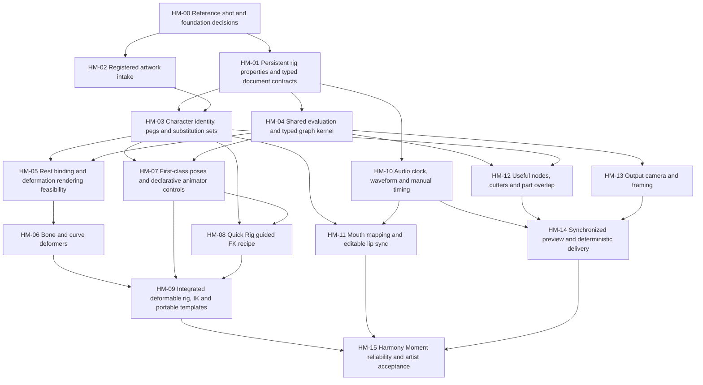

# Harmony Moment delivery plan

> Generated from `roadmap.json`; edit the canonical JSON and regenerate.

[Rationale and code audit](REORIENTATION.md) · [Next tasks](FIRST-STEPS.md) · [Full phases](PHASES.md)

Harmony Moment: reusable speaking character shot. **Status: planned.** No new feature is implemented by this plan.

## Acceptance profile

- **Platform:** macOS development profile; exact hardware recorded in HM-00
- **Artwork:** Original sampled vector/raster artwork and registered transparent PNG parts; no PSD/SVG prerequisite
- **Shot:** 20 seconds, 1920x1080, 24fps plus 24000/1001 variant; one 12-20-part character, 8 mouth variants, 3 hands, 2 coordinated views, 2 bone/curve chains, 1 attachment, 12 published controls, 2 audio clips, 3 mattes and 1 orthographic camera
- **Delivery:** PNG sequence + PCM WAV + timing/color manifest; review movie encoding follows HM
- **Audio budget:** NFR-007 one-frame maximum drift over ten minutes; waveform/scrub aligns within one displayed frame
- **Proposed interaction budget:** On recorded hardware, cached 1080p/24fps preview; p95 control-to-preview <=50 ms at declared preview quality; resident memory <=2 GiB for the fixture. Proposed acceptance targets, not current measurements. Recalibration requires an explicit scope/quality decision.
- **Correctness:** No unresolved data loss/critical workflow defect; legacy migrations backed up, rig IDs portable, deterministic reopened exports, artistic acceptance required

## Scheduling rules

Phase depends_on constrains full epic completion, not entry into an implementation slice. Only the explicit delivery-slice contract DAG gates the Harmony Moment. Domain dependencies are scope relationships, not all-features barriers.

Start a slice only when each required contract has accepted evidence. Baseline reuse is partial and must be qualified; planned is not ready. Independent spikes may run without claiming their consumer ready.

One integration owner; at most two bounded slices with distinct owners when people are available. For one implementer, follow priority_order sequentially.

## Contract dependency graph

## Work and ordering

Remaining bounded work: **47–92 engineer-weeks**, low confidence. This is included within phase scope, not added to its full-program envelope.

Dependency-only longest chains under the lower/upper estimates (unlimited staffing, no resource contention; **not delivery dates**):

- Lower: HM-00 → HM-01 → HM-03 → HM-05 → HM-06 → HM-09 → HM-15; 23 serial engineer-weeks.
- Upper: HM-00 → HM-01 → HM-03 → HM-05 → HM-06 → HM-09 → HM-15; 45 serial engineer-weeks.

| Slice | Owner | Hard prerequisites | Remaining engineer-weeks |
|---|---|---|---:|
| [HM-00](#hm-00) — Reference shot and foundation decisions | P00 / architecture | None | 1–2 |
| [HM-01](#hm-01) — Persistent rig properties and typed document contracts | P01 / document/application/storage | HM-00 | 3–6 |
| [HM-02](#hm-02) — Registered artwork intake | P02 / interchange/drawing | HM-00 | 1–3 |
| [HM-03](#hm-03) — Character identity, pegs and substitution sets | P08 / rigging/document | HM-01, HM-02 | 3–6 |
| [HM-04](#hm-04) — Shared evaluation and typed graph kernel | P10 / animation/compositing/render | HM-01 | 3–6 |
| [HM-05](#hm-05) — Rest binding and deformation rendering feasibility | P09 / deformation/render | HM-03, HM-04 | 2–4 |
| [HM-06](#hm-06) — Bone and curve deformers | P09 / deformation/animation | HM-05 | 6–12 |
| [HM-07](#hm-07) — First-class poses and declarative animator controls | P08 / controllers/rigging | HM-03, HM-04 | 3–6 |
| [HM-08](#hm-08) — Quick Rig guided FK recipe | P08 / rigging/presentation | HM-03, HM-07 | 2–4 |
| [HM-09](#hm-09) — Integrated deformable rig, IK and portable templates | P09 / rigging/deformation/library | HM-06, HM-07, HM-08 | 4–8 |
| [HM-10](#hm-10) — Audio clock, waveform and manual timing | P07 / audio/media | HM-01 | 4–7 |
| [HM-11](#hm-11) — Mouth mapping and editable lip sync | P07 / audio/rigging | HM-03, HM-10 | 2–4 |
| [HM-12](#hm-12) — Useful nodes, cutters and part overlap | P10 / compositing/presentation | HM-04, HM-03 | 4–7 |
| [HM-13](#hm-13) — Output camera and framing | P06 / camera/animation | HM-04 | 2–4 |
| [HM-14](#hm-14) — Synchronized preview and deterministic delivery | P07 / render/jobs/media | HM-10, HM-12, HM-13 | 3–6 |
| [HM-15](#hm-15) — Harmony Moment reliability and artist acceptance | P11 / quality/release | HM-09, HM-11, HM-14 | 4–7 |

## HM-00

**Reference shot and foundation decisions** — `complete`; owner `architecture`, work package `P00-W2`.

Freeze the bounded character-shot profile, failure fixtures and only the contracts needed by its next consumers. Audit current code instead of restarting all feasibility work.

**Required delivered contracts:**

- No earlier slice. Reuse evidence is an input to review, not a passed gate.

**Acceptance:**

- Record a redistributable 20-second 1080p/24fps character shot, a 24000/1001 variant and a ten-minute audio drift fixture with explicit budgets.
- Approve IDs/space/time/color/migration and command-ownership contracts, plus a saved-scene success rubric artistically reviewed by the project owner; record hardware rather than infer performance. Independent working-shot animator validation remains HM-15.

**Explicitly outside this slice:**

- No blanket renderer rewrite, OpenToonz fork, full tablet matrix, docking framework or fill-topology gate.

**Catalog subsets:** PRJ-001, ANI-001.

**Library boundaries:** existing adapters; no new library required by this slice.

**Existing evidence to inspect (not slice completion):**

- [docs/implementation/status.json](../../docs/implementation/status.json)
- [modules/document/include/opentoon/document.h](../../modules/document/include/opentoon/document.h)

## HM-01

**Persistent rig properties and typed document contracts** — `in_progress`; owner `document/application/storage`, work package `P01-W2`.

Expose stable typed part/peg/property addresses over the existing full-pose evaluator and Session commands. Preserve the current transform-key representation through a compatibility adapter; introduce discrete or specialized tracks only with their actual character/deformer consumers. Define rest/authored/evaluated ownership and transactional persistence. Character/deformer/audio/node payloads are added by their owning slices, not empty schemas in advance.

**Required delivered contracts:**

- HM-00: Accepted stable entity/property IDs, transform spaces, rational time and migration policy

**Acceptance:**

- Existing full-pose keys, easing, visual curve edits and key-block edits retain their sampled behavior through the property-address adapter; reject dangling IDs, invalid types/values and duplicate keys. No wholesale curve-engine rewrite is required.
- Version new persisted semantics, back up migrations and fail safely in older readers; undo/save/reopen and injected failures retain all references.
- Separate rest/setup values, authored animation, evaluated results and view state; expose one command/query boundary for the UI and evaluator.

**Explicitly outside this slice:**

- No embedded scripting, arbitrary expressions or general plugin API.
- No upfront migration of every legacy transform channel to a new keyframe engine; version only schema changes required by actual consumers.

**Catalog subsets:** PRJ-001, PRJ-004, PRJ-005, LYR-001, ANI-001, ANI-002, ANI-003, ANI-004, ANI-005, PRJ-003, ANI-006, ANI-007, ANI-009.

**Library boundaries:** LIB-SQLITE, LIB-JSON, LIB-ZSTD.

**Existing evidence to inspect (not slice completion):**

- [modules/document/include/opentoon/document.h](../../modules/document/include/opentoon/document.h)
- [modules/application](../../modules/application)
- [adapters/storage](../../adapters/storage)

## HM-02

**Registered artwork intake** — `complete`; owner `interchange/drawing`, work package `P02-W3`.

Qualify existing drawing and still-image import; add ordered PNG sequence intake and registered part intake with explicit sequence-versus-parts choice, missing-frame reports and asset bounds. Existing vector/raster tools supply original artwork.

**Required delivered contracts:**

- HM-00: Defined image origin, alpha, color profile, resource bounds and part-registration fixture

**Acceptance:**

- Round-trip original sampled vectors and transparent PNG parts without shifting their registration or changing color IDs.
- A failed/cancelled multi-file import leaves no half-created document; sequence gaps and ordering are explicit.

**Explicitly outside this slice:**

- PSD, SVG, vectorization, advanced brush presets and analytic fill are not required; pre-separated PNG parts are a supported route.

**Catalog subsets:** IMP-001, VEC-001, RAS-001, COL-001, LYR-002, VEC-003, VEC-009.

**Library boundaries:** LIB-QT, LIB-MYPAINT.

**Existing evidence to inspect (not slice completion):**

- [adapters/qt/editor_controller.cpp](../../adapters/qt/editor_controller.cpp)
- [adapters/render/scene_renderer.cpp](../../adapters/render/scene_renderer.cpp)
- [adapters/brush](../../adapters/brush)

## HM-03

**Character identity, pegs and substitution sets** — `planned`; owner `rigging/document`, work package `P08-W1`.

Create a character root and stable part roles; keep separate transform hierarchy and render order. Add preserve-world reparenting, rest pivots, named thumbnail substitutions, held selector tracks and coordinated variant sets.

**Required delivered contracts:**

- HM-01: Typed stable part/peg/property IDs and atomic persistence
- HM-02: Validated drawings and registered imported parts

**Acceptance:**

- Build a rigid character and change mouth/hand/view without moving its peg, overwriting transform keys or affecting another character.
- Reparent supported negative/nonuniform transforms without registration jumps; reject nonrepresentable shear or singular cases explicitly.
- Coordinated variants switch atomically, missing members are reported, and duplicate instances get independent bindings.

**Explicitly outside this slice:**

- Automatic image segmentation, full library management and deformation are not prerequisites for rigid cut-out.

**Catalog subsets:** RIG-001, RIG-002, RIG-003, RIG-006, RIG-007, RIG-008, LYR-001, LYR-004, LYR-005, LYR-007, TIM-002, TIM-003, TIM-005.

**Library boundaries:** existing adapters; no new library required by this slice.

**Existing evidence to inspect (not slice completion):**

- [modules/document/include/opentoon/document.h](../../modules/document/include/opentoon/document.h)
- [adapters/qt/editor_controller.cpp](../../adapters/qt/editor_controller.cpp)
- [modules/document/src/timeline.cpp](../../modules/document/src/timeline.cpp)

## HM-04

**Shared evaluation and typed graph kernel** — `planned`; owner `animation/compositing/render`, work package `P10-W1`.

Extract the existing ordered painter into a shared evaluation boundary with typed image/transform/matte inputs, DAG validation, revision invalidation and explicit Display/Write targets. Register operators only with consumers. Use a restricted linear-sRGB premultiplied composition profile and preserve legacy scene appearance through an explicit legacy profile.

**Required delivered contracts:**

- HM-01: Addressed animated properties, immutable snapshots and versioned persistence

**Acceptance:**

- Known ordered legacy scenes retain their declared appearance on migration; new-profile alpha charts and UI/headless outputs match within recorded tolerance.
- Detect cycles, dangling references and incompatible ports; edited upstream properties invalidate descendants and stale jobs cannot publish.
- Define solve ordering for property drivers, hierarchy, deformation, attachments, camera and image composition without conflating the transform graph with the image graph.

**Explicitly outside this slice:**

- No full node editor, large effect catalog, HDR/EXR, OCIO configuration manager or GPU rewrite.

**Catalog subsets:** NOD-002, NOD-005, NOD-008, NOD-009, COL-014, COL-015.

**Library boundaries:** LIB-QT.

**Existing evidence to inspect (not slice completion):**

- [adapters/render/scene_renderer.cpp](../../adapters/render/scene_renderer.cpp)
- [modules/application](../../modules/application)

## HM-05

**Rest binding and deformation rendering feasibility** — `planned`; owner `deformation/render`, work package `P09-W1`.

Prove the complete bind-to-render route before authoring tools: rest mesh/UVs, editable bind controls and per-substitution binding compatibility. Start with bounded regular meshes over alpha artwork; compare tessellation only if the fixture requires it. Retain editable source vectors and use an explicitly resolution-limited render proxy where needed.

**Required delivered contracts:**

- HM-03: Stable part/variant bindings and rest-space transforms
- HM-04: One evaluated geometry/image boundary and explicit alpha/color contract

**Acceptance:**

- Checker artwork survives rest/pose/reset without UV drift, seams or accumulated deformation; benchmark the actual renderer, not only a solver.
- Reject degenerate geometry and incompatible substitutions; rebinding reports affected animation rather than silently discarding it.
- Choose and pin a proven numerical/render route within the spike budget; if the texture warp cannot meet quality/cost, resolve that blocker before HM-06.

**Explicitly outside this slice:**

- No claim of native analytic vector deformation; no dependency on full region topology, optimal meshing or libigl weight solvers.

**Catalog subsets:** DEF-008, DEF-009, DEF-010, DEF-015.

**Library boundaries:** LIB-EIGEN, LIB-TESS.

**Existing evidence to inspect (not slice completion):**

- [adapters/render/scene_renderer.cpp](../../adapters/render/scene_renderer.cpp)
- [docs/implementation/BRUSH-BENCHMARK.md](../../docs/implementation/BRUSH-BENCHMARK.md)

## HM-06

**Bone and curve deformers** — `planned`; owner `deformation/animation`, work package `P09-W1`.

Deliver editable bone chains and curve chains with defined local/rest spaces, stable weights, predictable joint/tangent behavior and saved animated properties. Controls drag on canvas with cancellable previews; variant changes resolve their own binding.

**Required delivered contracts:**

- HM-05: Accepted rest mesh/UV/binding representation and measured deformation render path

**Acceptance:**

- Animate a bent arm and curved torso/tail with rest reset, key interpolation, undo and saved/rendered equivalence.
- Extreme bends, zero-length bones and invalid weights give bounded behavior without NaNs or corrupting rest data; proxy resolution limits are visible.
- Pass the bounded B4/HM shot quality and interaction budgets; unresolved seam/texture artifacts block the deformer claim.

**Explicitly outside this slice:**

- Envelope/automatic envelope, free-form, shape-aware and deformer-on-deformer remain long-term requirements.

**Catalog subsets:** DEF-001, DEF-003, DEF-008, DEF-009, DEF-010, DEF-015.

**Library boundaries:** LIB-EIGEN.

**Existing evidence to inspect (not slice completion):**

- New subsystem; no implementation claimed.

## HM-07

**First-class poses and declarative animator controls** — `planned`; owner `controllers/rigging`, work package `P08-W3`.

Save named masked poses including discrete substitutions; apply/mirror only explicitly mapped parts. Add direct widgets, limited sliders/switches and a compact character dashboard. Pose interpolation blends compatible numeric properties; discrete variants use an explicit threshold rule. Animator and Rig workspaces expose the same document at different detail levels.

**Required delivered contracts:**

- HM-03: Stable character/part IDs, substitutions and transform properties
- HM-04: Deterministic driver ordering, type checks and cycle rejection

**Acceptance:**

- A pose slider reproduces stored numeric and discrete endpoints exactly; applying a pose leaves excluded channels untouched.
- A widget edits only its published properties through ordinary commands; conflicting drivers or graph cycles cannot silently win.
- An animator can select a character, pose it and switch mouths without opening nodes; a rigger can inspect/edit all bindings in the same project.

**Explicitly outside this slice:**

- No Python, arbitrary script controllers, 2D pose grids or generic expression engine. Deformer controls activate only after HM-06.

**Catalog subsets:** RIG-012, RIG-014, CTL-001, CTL-002, CTL-004, CTL-005, UI-002, UI-009.

**Library boundaries:** existing adapters; no new library required by this slice.

**Existing evidence to inspect (not slice completion):**

- [adapters/qt/key_selection_controller.cpp](../../adapters/qt/key_selection_controller.cpp)
- [ui/components/SelectionProperties.qml](../../ui/components/SelectionProperties.qml)

## HM-08

**Quick Rig guided FK recipe** — `planned`; owner `rigging/presentation`, work package `P08-W4`.

Assign part roles and place joint guides directly on canvas; preview an editable FK hierarchy and control set before one commit. Offer a simple biped recipe and manual correction. Generated rigs use the same model as hand-authored rigs.

**Required delivered contracts:**

- HM-03: Character part/peg ownership and safe preserve-world operations
- HM-07: Published control/pose bindings and animator workspace

**Acceptance:**

- Create a FK character from registered parts with no manual node wiring; record setup time/actions against the same manual workflow without claiming superiority before measurement.
- Cancel/undo is atomic; missing roles, mirrored orientation and repeat-run update versus new-instance choice are explicit.
- The full rig view reveals every generated binding; guides never render.

**Explicitly outside this slice:**

- No AI/auto-segmentation, irreversible bake or unsupported deformer recipe.

**Catalog subsets:** RIG-015, RIG-001, RIG-002, RIG-003, RIG-014, CTL-005.

**Library boundaries:** existing adapters; no new library required by this slice.

**Existing evidence to inspect (not slice completion):**

- New subsystem; no implementation claimed.

## HM-09

**Integrated deformable rig, IK and portable templates** — `planned`; owner `rigging/deformation/library`, work package `P09-W3`.

Add kinematic endpoint/curve attachments, bounded two-bone IK with limits and explicit FK/IK ownership; extend Quick Rig with optional proven limb recipes. Close template dependency collection over parts, swatches, variants, poses, controls, bind data and animation. Use a validated local folder manifest first.

**Required delivered contracts:**

- HM-06: Working bone/curve evaluation with per-variant binding
- HM-07: Pose/control mappings and saved driver semantics
- HM-08: Editable guided rig recipe and role mappings

**Acceptance:**

- A hand/accessory follows a deformed arm without being deformed twice; unreachable targets preserve declared length/limit policy.
- Switch variants and apply poses without orphaned deformer links; shared versus independent imports are explicit and two instances animate independently.
- Template export/import remaps all IDs, rejects missing resources and includes all registered payload dependencies; later graph/matte payloads extend the same collector before HM-15.

**Explicitly outside this slice:**

- Multi-pin/nails, animated constraint switching, general IK networks, live template updates and archive transport are later.

**Catalog subsets:** RIG-009, DEF-011, DEF-012, DEF-010, CTL-001, CTL-008, LIB-002, LIB-004, LIB-005, RIG-012, RIG-015.

**Library boundaries:** LIB-EIGEN.

**Existing evidence to inspect (not slice completion):**

- New subsystem; no implementation claimed.

## HM-10

**Audio clock, waveform and manual timing** — `planned`; owner `audio/media`, work package `P07-W1`.

Adopt one playback backend after the miniaudio spike; start with WAV/PCM, waveform pyramids, trim/offset/gain, limited mixing and frame scrub. Audio device time drives playback, while headless sampling uses the same rational scene mapping.

**Required delivered contracts:**

- HM-01: Saved typed audio assets/clips, rational sample/frame conversion and cancellable snapshot jobs

**Acceptance:**

- Ten-minute 24 and 24000/1001 scenes stay within one-frame accumulated audiovisual drift; report underruns and dropped preview frames.
- Seek, loop, pause, device loss and sample-rate conversion do not desynchronize the playhead or mutate media; waveform peaks align with sample positions.
- Audio references, edits and original asset hashes survive undo/reopen; callbacks avoid document locks/allocations.

**Explicitly outside this slice:**

- No raster/vector completion, lip detector, FFmpeg codec catalog or audio recording prerequisite.

**Catalog subsets:** AUD-001, AUD-002, AUD-003, AUD-004, AUD-005, LYR-001.

**Library boundaries:** LIB-AUDIO.

**Existing evidence to inspect (not slice completion):**

- [modules/document/include/opentoon/document.h](../../modules/document/include/opentoon/document.h)
- [adapters/qt/editor_controller.cpp](../../adapters/qt/editor_controller.cpp)
- [conanfile.py](../../conanfile.py)

## HM-11

**Mouth mapping and editable lip sync** — `planned`; owner `audio/rigging`, work package `P07-W3`.

Map a small labelled viseme set to each character and edit held mouth timings against audio. Import a documented timing JSON with rational conversion and previewed merge ranges; preserve manual corrections.

**Required delivered contracts:**

- HM-03: Named mouth substitution IDs and held selector track
- HM-10: Audio time mapping, waveform and frame scrub

**Acceptance:**

- Complete English and Spanish dialogue by hand; flag unmapped labels and retain corrections through retiming, save/reopen and export.
- Imported labels cannot overwrite unrelated or protected manual timings; gaps, overlaps and clip offsets have explicit rules.

**Explicitly outside this slice:**

- Automatic recognition is a follow-on enhancement, not a dependency of reliable lip-sync editing.

**Catalog subsets:** AUD-007, AUD-008, RIG-006.

**Library boundaries:** existing adapters; no new library required by this slice.

**Existing evidence to inspect (not slice completion):**

- New subsystem; no implementation claimed.

## HM-12

**Useful nodes, cutters and part overlap** — `planned`; owner `compositing/presentation`, work package `P10-W2`.

Expose a small editable node graph: Drawing, Peg/Transform, ordered Composite, Opacity, Cutter/Matte, group ports, Display and Write. Add reversible front/back part ordering and manual joint matte recipes; a compact inspector hides graph complexity from animators.

**Required delivered contracts:**

- HM-04: Typed graph runtime, color/alpha and shared output evaluator
- HM-03: Character group and separate hierarchy/render-order identity

**Acceptance:**

- Animate an arm crossing the torso and mask an eye/joint with fractional alpha; group/ungroup and bypass preserve intended pixels and references.
- Graph edits reject incompatible ports/cycles and undo atomically; a matte is not treated as binary.
- The template dependency collector includes graph and matte resources; deleting referenced nodes cannot silently leave a partial rig.

**Explicitly outside this slice:**

- No automatic Auto Patch topology, general Z/multiplane, effects catalog, OpenFX or full node inventory.

**Catalog subsets:** NOD-001, NOD-003, NOD-004, NOD-005, NOD-006, NOD-008, NOD-009, RIG-004, RIG-005.

**Library boundaries:** existing adapters; no new library required by this slice.

**Existing evidence to inspect (not slice completion):**

- [adapters/render/scene_renderer.cpp](../../adapters/render/scene_renderer.cpp)

## HM-13

**Output camera and framing** — `planned`; owner `camera/animation`, work package `P06-W3`.

Add an explicit active orthographic output camera with animated pan/zoom/rotation and nonrendering framing guides. Separate camera edits from canvas navigation; retain drawing-local coordinates.

**Required delivered contracts:**

- HM-04: Shared evaluator, addressed transform properties and scene-to-output boundary

**Acceptance:**

- A camera move yields identical framing in preview, reopened scene and PNG export; viewport pan/zoom never changes exported composition.
- Camera keys interpolate with existing animation semantics, and invalid/singular framing fails clearly.

**Explicitly outside this slice:**

- Multiplane parallax, perspective/3D staging views and camera switching UI are post-milestone.

**Catalog subsets:** CAM-001, CAM-002, CAM-005, CAM-006, UI-006, UI-008.

**Library boundaries:** existing adapters; no new library required by this slice.

**Existing evidence to inspect (not slice completion):**

- [adapters/render/scene_renderer.cpp](../../adapters/render/scene_renderer.cpp)
- [adapters/qt/canvas_item.cpp](../../adapters/qt/canvas_item.cpp)

## HM-14

**Synchronized preview and deterministic delivery** — `planned`; owner `render/jobs/media`, work package `P07-W2`.

Preview the bounded shot from revision-keyed caches with visible dropped-frame/quality state. Export an exact-range PNG sequence plus synchronized PCM WAV and an explicit timing/color manifest; save/reopen the same immutable revision before comparing output.

**Required delivered contracts:**

- HM-10: Authoritative audio clock and exact scene-to-sample mapping
- HM-12: Evaluated node/matte composition and distinct Display/Write
- HM-13: Output-camera sampling shared by preview/export

**Acceptance:**

- Deliver every expected frame and sample interval at 24 and 24000/1001 with declared endpoint rounding; cancellation never reports complete output.
- UI, reopened and headless outputs agree for baseline drawing, camera and node/matte composition; late jobs cannot replace newer results. Deformer/rig combinations join the complete export regression at HM-15 after HM-09, without blocking this independent output slice.
- PNG plus WAV is the mandatory open delivery profile. Movie encoding is explicitly the next output extension after the milestone, not an implied capability.

**Explicitly outside this slice:**

- No codec catalog, HDR/EXR/multi-pass, video reference import or distributed render queue gate.

**Catalog subsets:** OUT-001, OUT-002, OUT-003, OUT-004, OUT-007, AUD-010, PRJ-004.

**Library boundaries:** existing adapters; no new library required by this slice.

**Existing evidence to inspect (not slice completion):**

- [modules/application](../../modules/application)
- [tests/export_tests.cpp](../../tests/export_tests.cpp)

## HM-15

**Harmony Moment reliability and artist acceptance** — `planned`; owner `quality/release`, work package `P11-W1`.

Run the complete original-art and imported-parts routes on the declared Mac profile: create character, variants, Quick Rig, bone/curve edits, poses/IK, dialogue, cutters, camera move, preview, save/reopen and export. Reuse the character in a second scene and exercise failures; this is a bounded workflow milestone before full P11/1.0.

**Required delivered contracts:**

- HM-09: Reusable deformable character with functioning controls, attachments and template closure
- HM-11: Editable dialogue/mouth timing
- HM-14: Camera/node preview and synchronized deterministic output

**Acceptance:**

- An animator other than the implementer completes both 20-second shot routes using the guide, without manual JSON repair or developer assistance; record blockers and setup/pose correction time.
- No known data-loss or critical workflow blocker; undo/redo, crash recovery, missing assets and legacy migration retain recoverable project/rig state.
- Reopened outputs match; template reuse remaps controls, bind variants, graph/matte and media references completely. Pass published frame/latency/memory budgets for the fixture, without claiming all catalog NFRs.
- Record Mac hardware, exact dependencies/notices and limitations. Physical tablets and wider OS/install qualification remain explicit open gates; publication is a separate owner decision.

**Explicitly outside this slice:**

- Not Harmony parity, full phase completion or a supported cross-platform 1.0.

**Catalog subsets:** PRJ-005, PRJ-006, PRJ-007, PRJ-009, LIB-002, CTL-008.

**Library boundaries:** existing adapters; no new library required by this slice.

**Existing evidence to inspect (not slice completion):**

- [docs/implementation/status.json](../../docs/implementation/status.json)
- [tests/storage_tests.cpp](../../tests/storage_tests.cpp)

## Claims excluded from this milestone

- Harmony file compatibility or full feature parity
- All P00-P11 phase exit criteria
- Physical tablet, Intel, Linux/Windows or clean-machine qualification
- Measured superiority over Harmony before comparative artist study

## Retained follow-on work

Each catalog feature still has exactly one primary completion phase. A slice only schedules its declared subset; it does not weaken the full feature acceptance.

| Feature | Primary phase | Priority | Reason |
|---|---|---|---|
| RIG-010 — Nails and IK constraints | P13 | next | High-value extension after HM; does not block the bounded character-shot profile. |
| RIG-011 — Constraint keyframes | P13 | next | High-value extension after HM; does not block the bounded character-shot profile. |
| DEF-004 — Envelope deformation | P09 | next | High-value extension after HM; does not block the bounded character-shot profile. |
| DEF-014 — Envelope generation | P09 | next | High-value extension after HM; does not block the bounded character-shot profile. |
| CTL-003 — Pose grid | P13 | next | High-value extension after HM; does not block the bounded character-shot profile. |
| CAM-003 — Multiplane | P06 | next | High-value extension after HM; does not block the bounded character-shot profile. |
| AUD-006 — Lip-sync detection | P07 | next | High-value extension after HM; does not block the bounded character-shot profile. |
| IMP-002 — Layered PSD | P16 | next | High-value extension after HM; does not block the bounded character-shot profile. |
| IMP-003 — PSD layout | P16 | next | High-value extension after HM; does not block the bounded character-shot profile. |
| IMP-004 — External vectors | P16 | next | High-value extension after HM; does not block the bounded character-shot profile. |
| OUT-005 — Video with audio | P07 | next | First output extension after HM: validated review-movie encoding/muxing against the PNG+WAV reference. |

All other retained requirements and their deferral notes are queryable with `roadmap.py feature ID`. The full catalog and long-term phases remain authoritative.
