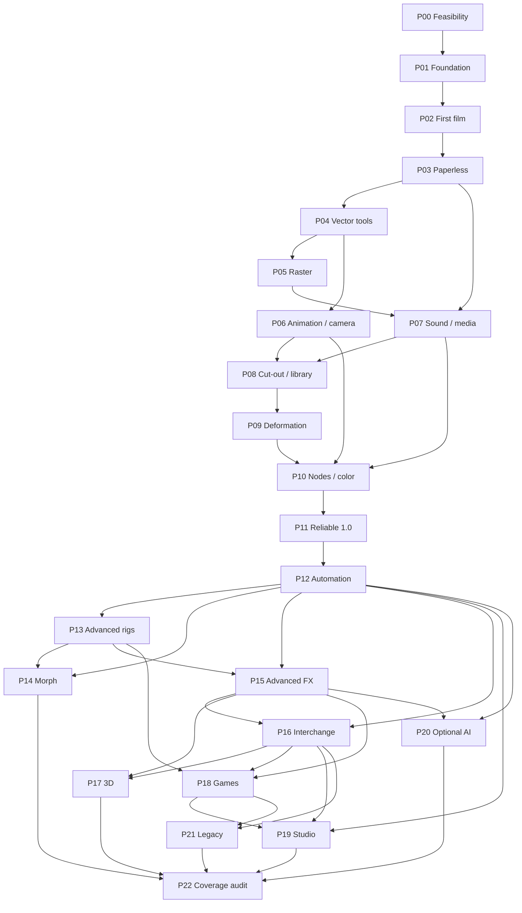

# Long-term development roadmap

**Status: active execution plan. An experimental editor exists; no phase is complete.** See [implementation status](../implementation/STATUS.md). This plan covers all **282 catalog capabilities**, assigns specification ownership for **193 node/family entries**, and organizes delivery into **23 phases with 69 work packages**. The accepted direction is **C++20 + Qt 6 / Qt Quick**, with an offline modular core and mature open-source components behind explicit adapters.

**English is the product language.** UI, menus, tools, messages, accessibility labels, built-in assets, help, code identifiers and public documentation must be English. This roadmap and the previous research, Markdown documents and canonical catalogs are written in English. User-created names, dialogue, drawings and filenames remain multilingual. See [the language policy](../design/02-language-policy.md).

## Read and query the plan

- [Phase table and individual specifications](PHASES.md): outcomes, dependencies, work packages, acceptance, effort and capability IDs.
- [Open-source dependency register](LIBRARIES.md): 28 library/tool entries, primary sources, evaluation gates and fallback decisions.
- [Engineering execution rules](EXECUTION.md): architecture, quality, dependency adoption and Definition of Done.
- [Effort, staffing and uncertainty](ESTIMATES.md): honest long-term envelopes and recalibration rules.
- [First implementation backlog](FIRST-STEPS.md): concrete issues for feasibility and the first usable slice.
- Canonical machine-readable records: [roadmap](roadmap.json), [libraries](libraries.json), [node ownership](node-assignments.json).

```sh
python3 scripts/roadmap.py stats
python3 scripts/roadmap.py phase P09
python3 scripts/roadmap.py feature DEF-005
python3 scripts/roadmap.py library LIB-MYPAINT
python3 scripts/catalog.py show DEF-005
python3 scripts/roadmap.py render
python3 scripts/validate_docs.py
```

Read the assignment first, then the phase, then the feature requirement and relevant architecture contract. These are complementary: phase work packages do not replace the catalog acceptance criteria. The validator checks complete feature assignment, phase dependencies, node ownership, quality IDs, library entries and generated document freshness.

## Delivery strategy

The first release must complete a real animation: **create → draw → expose → play → save → reopen → export**. A collection of attractive panels is not a milestone. A minimal ordered compositor and a shared scene evaluator exist in P02; a graph editor and advanced color pipeline come later. Define color/alpha and rational-time contracts early, even when the first implementation only supports a restricted subset.

| Horizon | Phases | Useful outcome |
|---|---|---|
| Technical confidence | P00–P01 | Measured graphics/tablet/storage decisions, safe documents and an English monochrome shell |
| First usable animation | P02–P03 | v0.1 bouncing-ball film, then timeline/Xsheet and paperless workflows |
| Drawing and timing | P04–P07 | Professional vectors/palettes, raster brushes, keyframes, cameras, sound and practical output |
| Character and compositing tools | P08–P10 | Reusable cut-out rigs, deformation, nodes and managed color |
| Reliable core product | P11 | v1.0: tested offline 2D workflows, installers, migrations, recovery and English help |
| Advanced authoring | P12–P16 | Automation, advanced rigs/controllers, morphing, particles/effects and production interchange |
| Extended pipelines | P17–P19 | Mixed 2D/3D, open game export/runtime and optional studio coordination |
| Optional compatibility and assistance | P20–P21 | Licensed local AI tools and explicitly bounded legacy converters |
| Continuing maintenance | P22 | Evidence-backed coverage audit, upgrades, support policy and next roadmap |

The version labels express usable scope, not compatibility with another application. 1.0 deliberately means a reliable supported 2D product; the longer catalog includes substantial later work. Optional AI, studio services and legacy formats never become requirements to open, draw or export a local project.

## Dependency graph



Dependencies identify readiness for phase completion, not a ban on earlier experiments. For example, audio-clock feasibility happens in P00 and audio integration can start after P03; P07 completion includes mixed-media export after P05. Early lipsync timing does not require all advanced rigging. Studio work can start after stable revisions and command APIs; this staffing sequence completes game-export integration before the final shared queue/asset pilot. Teams may relax such delivery sequencing with a recorded capability-level dependency change.

The P22 audit may run even when optional branches are explicitly deferred: it audits their disposition, not imaginary completion. Only two adjacent delivery phases should be active for the initial small team; dependency independence is not free staffing.

## Coverage and scope control

Every feature has one **primary completion phase**. Earlier subsets retain `partial` until all agreed acceptance passes. Example: P02 provides the basic timeline needed for a film; `TIM-001` completes in P03 when its Xsheet portion is delivered. Likewise typed layers expand as raster, pegs and nodes arrive; unsupported types are explicit, not represented as completed UI placeholders.

Every node/family entry has a **specification owner phase**, distinct from feature completion. That owner must split family entries into operator tickets and define ports, parameter units/defaults, animability, color/alpha rules, bounds, tile halo, invalidation, errors and supported profiles. P22 audits the full inventory. No count is an automatic claim that all operators are independent or equivalent.

Conditional AI and legacy entries require model/parser/license/quality evidence. If they cannot be delivered, record a deferred decision with the precise missing prerequisite and retain their unimplemented state. They are not quietly deleted or counted as done.

Implementation is authorized through **P11**. Continue closing the outstanding gates in the [implementation status](../implementation/STATUS.md), using the issues in [FIRST-STEPS.md](FIRST-STEPS.md). Working subsets do not close a phase automatically.
