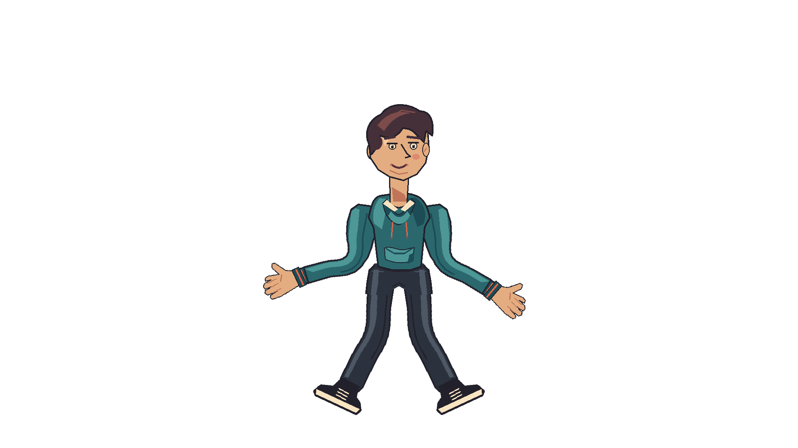
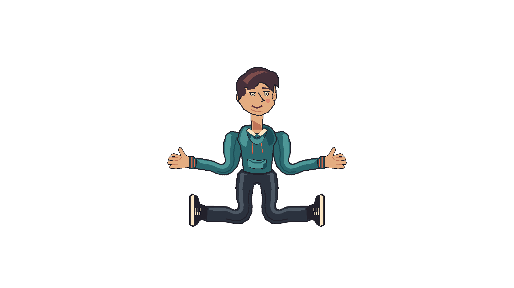
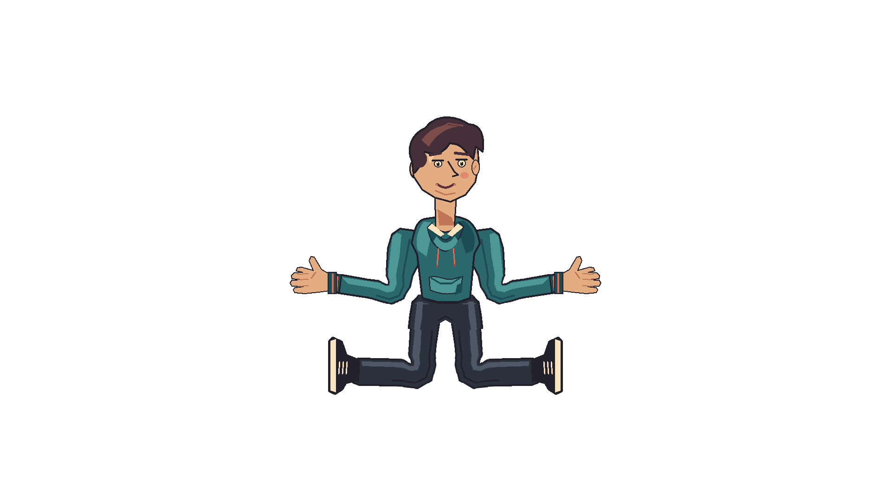
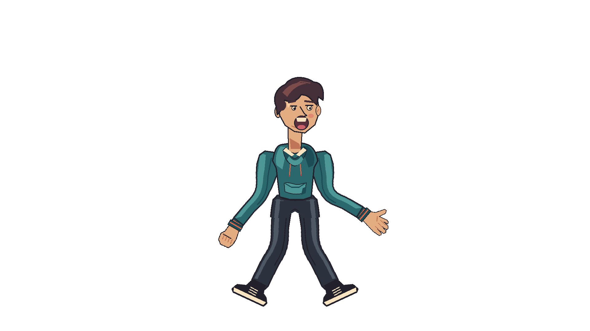

# Continuous Harmony limbs

This HM-06 fixture uses the same original character and canvas as the
19-part Harmony Moment intake fixture. Its four limbs are each a single
transparent 512 × 512 image with shoulder–elbow–wrist or hip–knee–ankle
rest joints. A fifth 512 × 512 image joins the trouser waist to both thighs
without a horizontal edge across either leg. Hands, feet, face substitutions,
torso and waist remain separately editable; their paint order covers the
attachment overlaps. The rendered silhouette has no artwork boundary at the
elbow or knee. `rig.json` specifies scene-space registration and bone transitions.

Run `python3 scripts/generate_harmony_continuous_limbs.py` to regenerate the
five committed images. The artwork is original GPL-3.0-or-later and derived
from our own procedural character palette and drawing code. The owner's
third-party Toon Boom examples were visual references only; no source image
or pixels from them are included.

`tests/test_harmony_continuous_limbs.py` checks deterministic generated bytes,
registered joint coverage and one connected alpha silhouette for each limb
and the waist.
`tests/mesh_render_tests.cpp` bends all four limbs as separate **single meshes**
inside a 15-artwork-Part character, follows hands/feet at their endpoints,
using four saved parent bone-tip links instead of authored follower position
keys, and checks rest pixels and reopened frame-24 output. The render test also
checks that every nonwhite character pixel belongs to one connected silhouette
in both rest and bent frames. A separate 90° stress pose checks the connected
assembled silhouette at every integer frame from rest to frame 36, rest pixel
stability and identical reopened output. The source art omits drawn creases at
the elbow and knee; a too-tight 55 px transition must reject a folding 90° key
on the regular rectangular grid without modifying the document. Contour
binding follows source alpha instead of transparent corners; its 40 px 90°
stress pose covers every opaque source pixel, keeps the full character
connected and survives save/reopen. An overly narrow 35 px transition on the
left arm rejects without changing the candidate. A source substitution with
its own bone binding retains the link; removing the source bone or exposing an unbound
substitution rejects atomically. This is a representative rig-quality
check, not final owner approval or a complete production shot.

The [openable example project](../../../examples/clockwork-continuous.otoon)
also exercises a separately bound sleeve drawing, linked fist substitution,
coordinated face view and return to Front. The native test compares that saved
project with its constructed document and rendered frames 36 and 44.
The native Qt Quick smoke test opens the same project and displays it.
The checked-in `format10-linked.otoon` is a frozen copy of the original
linked study before explicit rest anchors were added. The storage test loads
its four links, upgrades a copy to format 11 and reads the `.pre-v10.bak`
backup. The current example uses format 11. Its limb geometry and joint
registration are unchanged; its waist art replaces the earlier separate
pelvis drawing.

