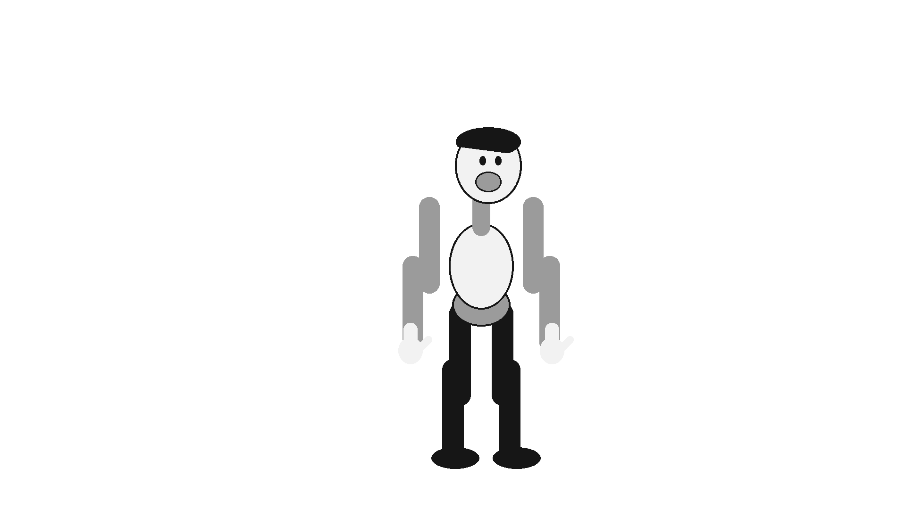

# Harmony Moment reference input

`shot.json` is the original **Clockwork Hello** 480-frame speaking-character brief.
`scripts/generate_harmony_fixture.py` creates 41 transparent registered PNG part and
substitution images, two mono 48 kHz/16-bit PCM timing clips plus a fractional-rate
dialogue variant, optional ten-minute
drift audio, and a SHA-256 provenance inventory. Run:

```sh
python3 scripts/generate_harmony_fixture.py --long-audio --previews
```

Generated files go to ignored `build/harmony-moment-fixture/`. The script uses only
Python's standard library; the artwork and tones are original GPL-3.0-or-later
contributions. No Harmony artwork, manual assets, private recording or generated
voice model is included. The tones are **timing signals, not speech**. A future
artist-approved dialogue recording is required to judge actual lip-sync quality.
The 41 source PNGs are also checked in under `parts/` so import and render tests
can use real encoded images without generating them at build time. The test verifies
that each checked-in asset exactly matches the generator.
`--previews` renders five full-resolution reference poses for visual review; they
are external acceptance targets, not frames from the OPEN-TOON evaluator.



The five checked-in reference stills are `reference_0000.png`, `reference_0120.png`,
`reference_0240.png`, `reference_0360.png` and `reference_0479.png`. Regenerate them
with the command above after any source-art change.

The shot has 19 stable part roles, eight mouth choices per view, three choices for
each hand, front and three-quarter coordinated face views, two proposed arm chains,
one evaluated hand attachment, twelve proposed controls, three matte targets and one
output camera. The 480 frames span 20.000 s at 24 fps and 20.020 s at 24000/1001.
Audio assets contain 960,960 samples: use the 24 fps dialogue cues at `frame × 2000`
samples and trim both tracks to 960,000 samples for that export. The 24000/1001
dialogue cues use `frame × 2002` samples and the full 960,960-sample duration.
All intervals
are zero-based and half-open. Parts share a 256 × 256 transparent canvas and a
`(128,128)` origin so an intake adapter can verify registration without guessed crops.

This is **input and acceptance material**, not a finished OPEN-TOON rig, complete
rendered shot or evidence that substitutions/deformers/audio/nodes/camera work today.
The eventual animator review must record whether an artist can build the character
from original drawing and from the generated PNG parts; name variants, bind arms,
publish and animate controls, correct mouth choices against audio, set overlap and
matte order, frame the output camera, save/reopen, reuse the rig in a second scene,
and export matching PNG/WAV/timing metadata. Record elapsed setup/correction time,
errors and any workaround. HM-00 still needs that review of the shot rubric before
the slice is accepted.

Failure fixtures for subsequent slices derive from this bundle: missing or duplicate
registered parts, corrupted PNG/audio, alpha or origin mismatch, unresolved variant,
cycle or dangling ID, singular reparent, stale render publication, ten-minute drift,
interrupted save and a format-3 reopening. They are tests to implement at their
owning slice, not capabilities claimed by this fixture.
